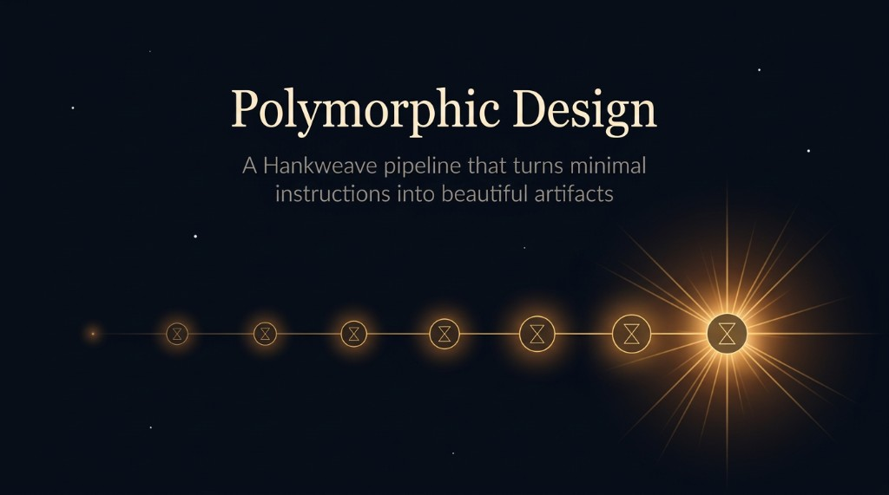

# Polymorphic Design

<p align="center">
  
</p>


A Hankweave pipeline that turns minimal instructions into beautiful, self-contained HTML artifacts.

Give it a sentence about what you want — a resume, a data visualization, a landing page, a report — plus optional design assets (fonts, inspiration images, brand materials). It thinks deeply about intent, researches design references, builds in three phases (structure → character → polish), reviews its own work twice, and outputs a single self-contained HTML file with embedded fonts.

## Tips

**For better output:**
- Say how it should *feel*, not just what it should contain. "Warm and editorial, like a magazine feature" beats "make a webpage."
- Drop 2-3 inspiration images in `design-pack/inspiration/`. Even rough screenshots help.
- Include fonts you like in `design-pack/fonts/`. The pipeline will use them.
- Put real content in `context/`. Placeholder content is never as good.

**For faster iteration:**
- Use `--fast` for initial runs, then switch to standard mode for the final version.
- Use `--validate` to check your setup without spending tokens.
- Resume interrupted runs — Hankweave picks up where it left off.

## Sample Project

The `sample-project/` folder is a ready-to-run example with:
- A sample instruction (interactive resume)
- A curated design pack with open-source fonts (Satoshi, HK Grotesk, Fira Code, Cardo, and more)
- Font pairing references and design technique images

All fonts are OFL (Open Font License) or equivalent free licenses.

## Quick Start

```bash
# 1. Create a project folder
./create-project.sh my-project

# 2. Edit my-project/instruction.md with what you want
#    (Optional) Drop fonts in my-project/design-pack/fonts/
#    (Optional) Drop inspiration images in my-project/design-pack/inspiration/
#    (Optional) Put raw content (data, text, specs) in my-project/context/

# 3. Set your API key
export ANTHROPIC_API_KEY="your-key"

# 4. Run it
./design.sh my-project
```

Or try the included sample project:

```bash
./design.sh sample-project
```

## Requirements

- **ANTHROPIC_API_KEY** — for Claude ([console.anthropic.com](https://console.anthropic.com/))
- **Node.js** v18+ — for npx/Hankweave
- **python3** — for font embedding in the final output
- **Chrome/Chromium** (optional) — for the visual verification screenshot

## How It Works

```
instruction.md + design-pack/ + context/
                    │
                    ▼
   ┌─ Understand Intent (Opus) ──────────┐
   │ Deep thinking about purpose,        │
   │ audience, emotion. Produces the     │
   │ greenprint — the design spine.      │
   └──────────────────┬──────────────────┘
                      ▼
   ┌─ Research & Enrich (Sonnet) ────────┐
   │ Reference archaeology, design-pack  │
   │ analysis, enriches the greenprint   │
   │ with concrete decisions.            │
   └──────────────────┬──────────────────┘
                      ▼
   ┌─ Build Foundation (Sonnet) ─────────┐
   │ Layout, hierarchy, tokens, all      │
   │ content placed. Intentionally       │
   │ boring — correct structure only.    │
   └──────────────────┬──────────────────┘
                      ▼
   ┌─ Build Character (Opus) ────────────┐
   │ Creative push: signature element,   │
   │ custom visualizations, dramatic     │
   │ typography. Where it gets a soul.   │
   └──────────────────┬──────────────────┘
                      ▼
   ╔═ Review & Refine Loop ×2 ══════════╗
   ║ Sonnet reviews with fresh eyes,    ║
   ║ then fixes what it found.          ║
   ║ Artifact backed up each iteration. ║
   ╚══════════════════╦═════════════════╝
                      ▼
   ┌─ Build Polish (Sonnet) ─────────────┐
   │ Transitions, accessibility,         │
   │ spacing, hover states, edge cases.  │
   │ Absorbs review feedback.            │
   └──────────────────┬──────────────────┘
                      ▼
   ┌─ Visual Verify (Opus) ─────────────┐
   │ Screenshots the artifact. Final    │
   │ visual assessment. Fonts embedded. │
   └──────────────────┬──────────────────┘
                      ▼
          self-contained HTML file
```

## Input Structure

```
my-project/
├── instruction.md          # What to make (can be one sentence)
├── design-pack/            # Optional design assets
│   ├── fonts/              # Font files (.otf, .ttf, .woff, .woff2)
│   │   └── font-files/     # The actual font files
│   ├── code-snippets/      # Code/monospace font references
│   └── inspiration/        # Reference images, screenshots of designs you like
└── context/                # Raw content for the output
                            # (papers, data, specs, text — whatever it needs)
```

The richer your input, the better the output. A one-liner works. A detailed brief with fonts and inspiration images produces something significantly better.

## Output

A self-contained HTML file in the output directory with all fonts base64-embedded. Open it in any browser — no server needed, no external dependencies.

## Cost

| Mode | Cost | Models |
|------|------|--------|
| Standard | ~$10-15 | Opus (understand, character, verify) + Sonnet (everything else) |
| Fast (`--fast`) | ~$5-8 | All Sonnet |

The `--fast` flag uses `hank-fast.json` — same pipeline, all Sonnet. Good for iteration, testing, and budget-conscious runs. Standard mode uses Opus for the creative and judgment-heavy steps.


## File Inventory

```
hank.json              # Main config (Opus + Sonnet)
hank-fast.json         # Budget variant (all Sonnet)
prompts/
  system.md            # Global system prompt (workspace layout, core principles)
codons/
  understand/prompt.md # Deep intent analysis → greenprint
  research/prompt.md   # Reference archaeology, design-pack analysis
  build-foundation/    # Structure, layout, tokens, content placement
  build-character/     # Creative push, signature element, typography
  build/system.md      # Shared build system prompt (all build codons)
  review/prompt.md     # Fresh-eyes structural audit
  fix/prompt.md        # Apply review improvements
  build-polish/        # Transitions, accessibility, edge cases
  verify/prompt.md     # Visual screenshot + final assessment
scripts/
  embed-fonts.py       # Base64-embeds fonts into the HTML
  embed-fonts.sh       # Shell wrapper for the above
  inventory-design-pack.sh  # Generates design-pack inventory for agents
  screenshot.sh        # Chrome headless screenshot
create-project.sh      # Scaffolds a new project folder
design.sh              # Runs the pipeline
sample-project/        # Ready-to-run example input
```

## Built With

- [Hankweave](https://hankweave.southbridge.ai) — Runtime for agentic workflows
- [Claude](https://anthropic.com) — Opus for creative direction, Sonnet for implementation
